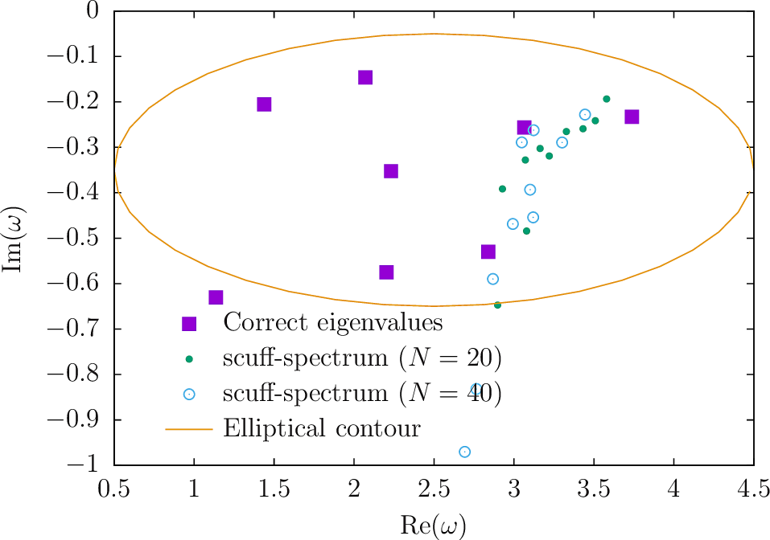

# libBeyn: A C++ Implementation of Beyn's Contour-Integration Method for Nonlinear Eigenproblems

<span style="font-variant:small caps">libBeyn</span> is a C++
library that implements the contour-integration method for
nonlinear eigenproblems described by W-J. Beyn in this paper:

+ Wolf-J&uuml;rgen Beyn, ``An integral method for solving nonlinear eigenvalue problems.'' *Linear Algebra and its Applications* **436** 3839 (May 2012).

+ DOI: [https://doi.org/10.1016/j.laa.2011.03.030](https://doi.org/10.1016/j.laa.2011.03.030)

+ ArXiV: [https://arxiv.org/abs/1003.1580](https://arxiv.org/abs/1003.1580)

More specifically, using a modified version of Beyn's notation,
we consider nonlinear eigenproblems of the form

**T**(*z*) **v** = 0

where **T** is a *D&times;D*-matrix-valued function of a complex
variable *z* and **v** is an *D*-dimensional complex vector.
(Beyn's notation uses lower-case *m* for the dimension *D* and
does not use boldface for matrices or vectors.)

`libBeyn` includes both a C++ library and a
(totally separate) native [Julia](https://julialang.org)
code that both implement Beyn's algorithm.

# Dependencies, building, installation

+ The `libBeyn` library and the C++ application codes that use it depend on [SCUFF-EM][scuffem], so you will need to download and install that code first if you want to use the C++ version of the code.  

+ The repository includes a simple handwritten `Makefile,` which you will want to modify to configure things like the location of your SCUFF-EM installation

+ Then just `make` to build the library `libBeyn.a` and the executables `tBeyn411` and `scuff-spectrum`.

+ Alternatively, you can bypass the C++ code and [use the separate, native `julia` implementation provided in the `julia` folder](#julia) to solve nonlinear eigenproblems.

## API

The `libBeyn` API is extremely simple; it basically just exports
a single routine, plus some associated support routines.

### Initialize data structure

```C++
 BeynSolver *CreateBeynSolver(int D, int L);
```

Allocate, initialize, and return a `BeynSolver` structure
for a problem of dimension *D* in which we expect no more
than *L* eigenvalues to reside within the integration we specify.

### Solve nonlinear eigenproblem (circular contour)

```C++

 int BeynSolve(BeynSolver *Solver, BeynFunction UserFunction, void *UserData,
               cdouble z0, double R, int N);
```

Compute all eigenvalues inside a circular contour,
centered at `z0` with radius `R,` using `N`-point trapezoidal-rule
quadrature for contour integrals.
(Here `cdouble` is short for `std::complex<double>`).

The parameters are as follows:

+ `BeynSolver *Solver`

    + Data structure created by a prior call to `CreateBeynSolver().`

+ `BeynFunction UserFunction`
+ `void *UserData`

    + User-supplied function that performs linear algebra involving the **T** matrix (see below).

+  `cdouble z0`
+  `double R`
+  `int N`

    + Together these parameters specify the integration contour (a circle
centered at `z0` with radius `R`) and the quadrature strategy (`N`-point
rectangular rule).

The return value of `BeynSolve` is the number of eigenvalues
identified within the given contour. The actual eigenvalues
and eigenvectors are stored within the `Solver` structure (see below).

### Solve nonlinear eigenproblem (elliptical contour)

```C++
 int BeynSolve(BeynSolver *Solver, BeynFunction UserFunction, void *UserData,
               cdouble z0, double Rx, double Ry, int N);
```

A variant of the above routine in which the integration contour
is an ellipse centered at `z0` with horizontal and vertical
radii `Rx`, `Ry`.

## User function

The prototype of the user-supplied function passed to `BeynSolve` is

```C++
  void UserFunction(cdouble z, void *UserData, HMatrix *VHat, HMatrix *MVHat);
```

where `VHat` is an *M&times;L* complex-valued matrix. 

If `MVHat` is non-null, the user's function should overwrite `MVHat`
with `T(z) * VHat`, i.e. the function should left-multiply `VHat`
by `T(z)` and store the result in `MVHat.`

If `MVHat` is null, the function 
should instead overwrite `VHat` with `T(z) \ VHat`, i.e. the function
should left-multiply the matrix `VHat` by the inverse of **T**(*z*)
and store the result in `VHat.`

**Note:** `HMatrix` is a simple LAPACK wrapper class provided by
the [`libhmat` support library for SCUFF-EM][libhmat], but
you don't really need to use `libhmat` if you don't want to;
just work directly with the three main fields of `HMatrix:`
```C++
 int NR      = VHat->NR;   // number of rows
 int NC      = VHat->NC;   // number of columns
 cdouble *ZM = VHat->ZM;   // row-major array of length NR*NC
```

### Eigenvalues and Eigenvectors

The eigenvalues and eigenvectors are stored in the `Lambda`
and `Eigenvectors` fields of `Solver.`
If the integer `K` returned by `BeynSolve` is nonzero, 

+ `Data->Lambda->GetEntry(k)` returns the `k`th eigenvalue (`k=0,1,...,K-1`)

+ `Data->Eigenvectors->GetEntry(m,k)` returns the `m`th component of the `k`th eigenvector.

+ `Data->Residuals->GetEntryD(k)` is the residual of the `k`th eigenvector, i.e. `|`**T**(z) **v~k~**`|`
   where **v~k~** is the `k`th eigenvector and `||` denotes L2 norm.

### Environment variables

The following environment variables may be set to customize the behavior
of the Beyn solver.

+ `SCUFF_BEYN_RANK_TOL=1.0e-4`
    The threshold magnitude for singular values to be considered relevant.

+ `SCUFF_BEYN_RES_TOL=1.0e-4`
    The threshold magnitude for the residual. Candidate eigenvectors for which
    `|`**T**(z) **v~k~**`|` exceeds this value are discarded.
    By default this is set to 0, in which case all eigenvectors are retained.

+ `SCUFF_BEYN_VERBOSE=1`
    Print more verbose messages to logfiles.

# Sample problem: Beyn example 4.11

For testing purposes, I consider the nonlinear eigenproblem
of Example 4.11 of the Beyn paper referenced above,
which in turn borrowed the example from this reference:

+ Kressner, D. "A block Newton method for nonlinear eigenvalue problems." *Numerische Mathematik* **114** 355 (2009)

+ DOI: [https://doi.org/10.1007/s00211-009-0259-x](https://doi.org/10.1007/s00211-009-0259-x)

This reference quotes 10-digit values for 5 eigenvalues on the 
real line, namely:

```bash
 Lambda1 = 201.88234012
 Lambda2 = 122.91317036
 Lambda3 = 63.692138408
 Lambda4 = 24.219005847
 Lambda5 = 4.4820338110
```

# Solving the problem with `libBeyn`

The `libBeyn` distribution includes a C++ code named `tBeyn411`
that uses `libBeyn` to solve the nonlinear eigenproblem.
Run `tBeyn411 --help` to summarize command-line options:

```bash
 unix% tBeyn411 --help

usage: tBeyn411 [options]

 options: 

  --z0 xx             (center of elliptical contour ({150,0}))
  --Rx xx             (horizontal radius of elliptical contour (148))
  --Ry xx             (vertical radius of elliptical contour (148))
  --N xx              (number of quadrature points (50))
  --L xx              (number of EVs expected in contour (10))
  --Dim xx            (dimension of problem (400))
```

Here's a sample run in which we ask for all eigenvalues in a circular contour
of radius `R=148` centered at `z0=150+2i`  with 25 quadrature points:

```bash
unix % tBeyn411 --z0 150+2i --Rx 148 --Ry 148 --N 25
Found 8 eigenvalues: 
0: {+3.006036828652e+02,-4.125966235335e-10} 
1: {+2.018823401134e+02,-1.492634460476e-09} 
2: {+4.190845874670e+02,+3.012321138414e-04} 
3: {+1.229131703422e+02,-1.611239586197e-09} 
4: {+6.369213835606e+01,-2.175300739538e-08} 
5: {+2.421900544828e+01,-1.314105806394e-07} 
6: {+4.482017101574e+00,-7.884401266534e-06} 
7: {+4.570891096865e-01,-1.236450296460e-04} 
2054 hikari /home/homer/work/libBeyn <> 
```

So, we've found all 5 of the correct eigenvalues, with
precision ranging from 10 digits (`Lambda1`) to 5 digits (`Lambda5`),
plus 3 spurious eigenvalues.

Let's try again with the same number of quadrature points but now
an *elliptical* contour, centered at the same point
but now much wider than it is tall:

```bash
2059 hikari /home/homer/work/libBeyn <> tBeyn411 --z0 150+2i --Rx 148 --Ry 5 --N 25
Found 7 eigenvalues: 
0: {+3.006036828638e+02,-2.343307770047e-10} 
1: {+2.018823401181e+02,-1.838840191226e-11} 
2: {+1.229131703566e+02,+2.110533969812e-12} 
3: {+6.369213840724e+01,-2.950528710244e-11} 
4: {+2.421900584303e+01,-3.840048279358e-09} 
5: {+4.482033592848e+00,+1.790884427422e-07} 
6: {+4.573368338358e-01,-2.154159593548e-05} 
```

We get one fewer spurious eigenvalue, plus
better accuracy in our determination of `Lambda5.`

<a name="julia"></a>
# Julia implementation

The `libBeyn` repository also includes a native [Julia](http://julialang.org)
implementation of the Beyn method, structured similarly to the
C++ library described above.
The main solver routine is `BeynSolve()` in
[`julia/BeynSolve.jl`](https://github.com/HomerReid/libBeyn/blob/master/julia/BeynSolve.jl)
and a test code that solves the Beyn Example 4.11 problem is in
[`julia/tBeyn411.jl`](https://github.com/HomerReid/libBeyn/blob/master/julia/tBeyn411.jl).

Usage example:

```julia
 unix % julia

julia> include("tBeyn411.jl")
SolveBeyn411 (generic function with 1 method)

julia> SolveBeyn411()
Found 7 nonzero singular values.
 1: {+3.006036828641e+02, -1.864047544792e-12} 
 2: {+2.018823401181e+02, -3.890499332734e-12} 
 3: {+1.229131703566e+02, +1.285568188887e-11} 
 4: {+6.369213840779e+01, +4.993707422805e-12} 
 5: {+2.421900584750e+01, -3.318073056626e-10} 
 6: {+4.482033815245e+00, -3.973736028485e-09} 
 7: {+4.573182886588e-01, +4.649270462093e-08} 
```

# Mode solver for <span style="font-variant:small caps">SCUFF-EM</span>

Also packaged with `libBeyn` is a first stab at a mode solver for
[SCUFF-EM](http://homerreid.github.io/scuff-em-documentation)
that uses Beyn's method to search for electromagnetic resonance
frequencies.
This code, called `scuff-spectrum,` inputs:

+ a [SCUFF-EM geometry file][Geometries]

+ a file containing a succession of `(omega0, R, N)` tuples.
  (For geometries with [1D or 2D lattice periodicity][PeriodicGeometries],
   each tuple also includes a 1D or 2D Bloch vector).

For each `(omega0, R, N)` tuple in the file, `scuff-spectrum` executes
Beyn's method---for a circular contour of radius `R,` centered at `omega0,`
using `N`-point rectangular-rule quadrature---to compute all resonance 
frequencies of the SIE impedance matrix **M**(&omega;)---lying within 
the contor. (A resonance frequency &omega; is simply a frequency at
which **M**(&omega;) has a nontrivial nullspace, in which case the
usual SIE equation **Ms**=**f** can have nonzero
surface-current solutions **s** even for vanishing incident 
fields **f**.)

## Example: Modes of a spherical dielectric cavity

As a simple test, I'll use `scuff-spectrum` to look for modes of a
spherical dielectric cavity---namely, a sphere of radius *R*=1 &mu;m,
filled with a homogeneous lossless dielectric with relative permittivity &epsilon;~r~=4. 
For this problem, I can compute the exact mode frequencies numerically by
looking for roots of the denominator of the Mie scattering coefficients
relating interior to incident fields for M-type and N-type
spherical polarizations. This calculation is described in Section 5.3
in [this memo][scuffSpherical].

Here's a plot of the lowest 8 resonant frequencies as computed via Mie theory
and the eigenvalues identified by SCUFF-SPECTRUM for a radius-1
sphere with &epsilon;=4, meshed into 501 panels,
for *N*=20 and *N=40* quadrature points.



The two calculations do not agree! What am I doing wrong?

[scuffem]:	 	http://homerreid.github.io/scuff-em-documentation
[libhmat]:	 	https://github.com/HomerReid/scuff-em/tree/master/src/libs/libhmat
[Geometries]:	        http://homerreid.github.io/scuff-em-documentation/reference/Geometries
[PeriodicGeometries]:	http://homerreid.github.io/scuff-em-documentation/reference/Geometries/#Extended
[scuffSpherical]:	http://homerreid.github.io/scuff-em-documentation/tex/scuffSpherical.pdf
